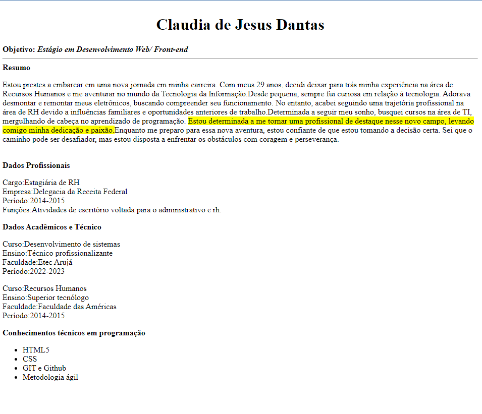
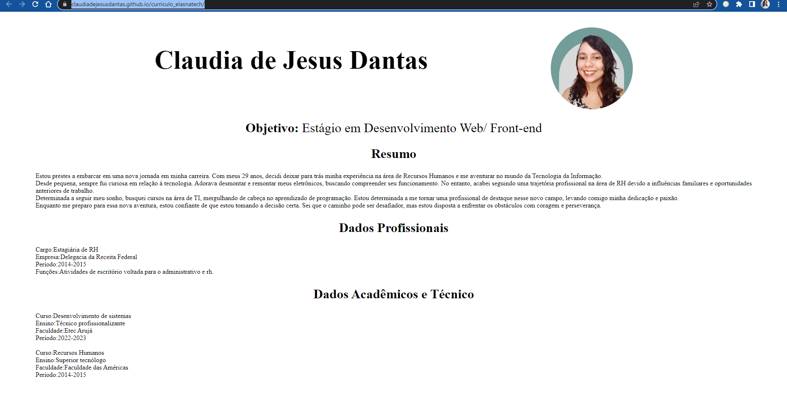

# Aula 06 
### Data: 27 de Junho de 2023 

  

## Atividade Proposta
Faça um site simples com as tags de HTML aprendidas em aula com a professora [Juliana Ribeiro Felipe](https://www.linkedin.com/in/julianaribeirof/), envie para o repositório do seu Github.
Publique esse site no Github Pages 😉

## Tecnologias utilizadas
* hmtl
* git
* vs code

### Link da página:
https://claudiadejesusdantas.github.io/curriculo_elasnatech/

Página atual (sem css)

Página anterior (com css)

